# Lawrence Mbugua

### Software Developer

Building reliable software, modern web applications, business systems, SaaS platforms, and API integrations.

**Available for Remote Opportunities Worldwide**

  
  
  

---

## About Me

I'm a Software Developer passionate about designing and building software that solves real-world problems.

My experience spans custom web applications, business management systems, SaaS platforms, e-commerce solutions, REST APIs, and third-party integrations.

I enjoy transforming ideas into scalable, maintainable, and user-friendly software, integrating external services, designing reliable application architectures, and continuously improving my development practices through real-world projects.

I believe great software should be reliable, secure, intuitive, maintainable, and deliver measurable value to the people who use it.

---

## Technical Expertise

- Custom Web Applications
- Business Management Systems
- SaaS Platforms
- Utility & Billing Systems
- E-commerce Solutions
- Inventory & POS Systems
- REST APIs & Third-Party Integrations
- Payment Gateway Integrations
- Business Process Automation
- Reporting & Analytics
- Responsive Web Applications
- Software Maintenance & Optimization

> Most professional work is developed for businesses and organizations, with a number of repositories remaining private.

---

## Technology Stack

### Languages

  
  
  
  
  
  

### Frameworks & Technologies

  
  
  
  
  
  
  
  

### Databases

  
  
  
  

### Development Tools

  
  
  
  
  
  
  

---

## Core Competencies

- Backend Development
- Software Design & Architecture
- Database Design
- REST API Design & Integration
- Authentication & Authorization
- Secure Software Development
- System Integration
- Performance Optimization
- Deployment & Maintenance

---

## GitHub Analytics

  
  

> GitHub analytics reflect public repository activity. Some professional projects are maintained in private repositories.

---

## Currently Exploring

- AI-Assisted Software Development
- Scalable SaaS Architecture
- Cloud Deployment
- Modern Frontend Development
- DevOps & CI/CD
- Software Architecture & Design Patterns

---

## Global Availability

### Available for Remote Opportunities Worldwide

Open to software development roles, remote opportunities, technical collaborations, and selected freelance projects worldwide.

---

## Connect

  
  
  

